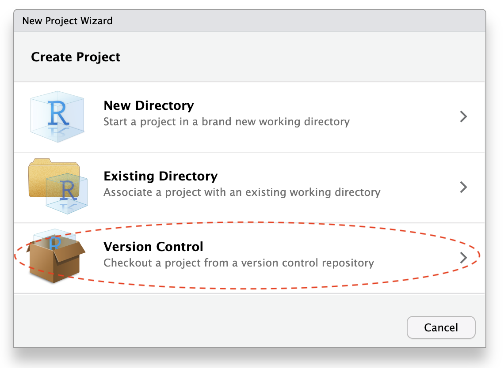
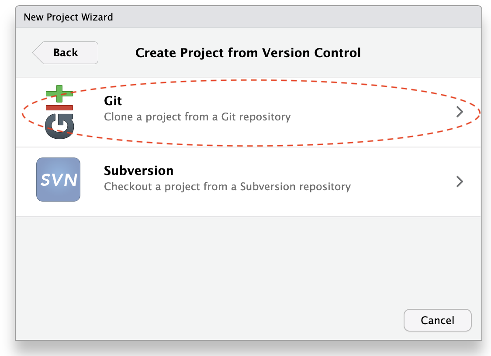
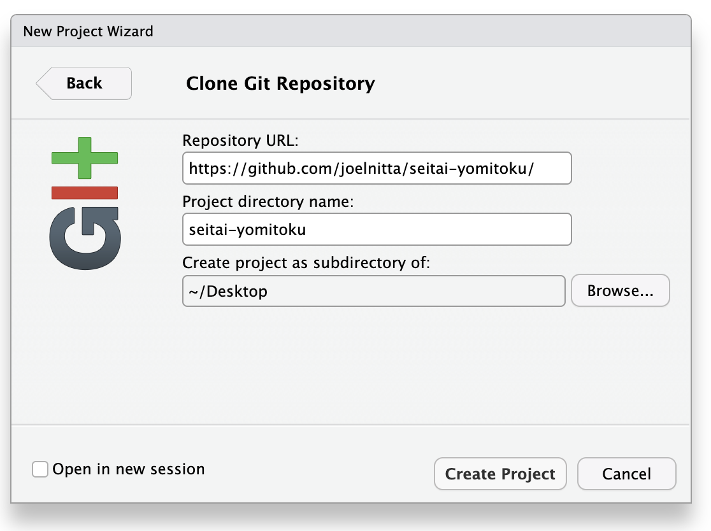

<!-- README.md is generated by README.qmd. Do edit README.md directly; instead edit README.qmd -->

# seitai-yomitoku-targets

このリポジトリは、「DNA情報で生態系を読み解く」（東樹 宏和
著）で紹介されている解析を再現するためのコードを提供します。

This repository provides code for replicating (some) of the analyses in
“DNA joho de seitai wo yomitoku” by Hirokazu Toju.

## コードの実行

このプロジェクトは[targets](https://github.com/ropensci/targets)でワークフロー管理を行なっています。

下の準備が終わったら、Rで以下のコマンドを実行するとワークフローが自動的に実行されます：

    targets::tar_make()

解析が全て無事に終了したら、`report.pdf`という結果や図が入っているリポートファイルが出力されます。

## 途中結果の確認

`targets::tar_make()`が終わったら、`_targets.R`に記述されているtarget（ワークフローの途中結果）を読み込むことができる。

例えば、各分類階級に同定された微生物の結果をこのように確認できます：

``` r
source("_targets.R") # このワークフローが使うパッケージと関数をロードする
tar_load(taxonomy_rank_count)

taxonomy_rank_count
```

    # A tibble: 7 × 2
      rank        n
      <chr>   <int>
    1 kingdom  5771
    2 phylum   3192
    3 class    2806
    4 order    2576
    5 family   2175
    6 genus    1857
    7 species  1096

## How to open in RStudio \| RStudioでの開き方

1.  RStudio の File メニューから New Project を選択して、次に Version
    Control を選択します。  
    
2.  Git を選択します。  
    
3.  Repository URLに
    <https://github.com/joelnitta/seitai-yomitoku/>、Project directory
    name に`seitai-yomitoku`、Create project as subdirectory of
    に任意のフォルダー（Desktopがおすすめ）を入力します。  
    
4.  Create project ボタンを押します。
5.  データをダウンロードする

## Data \| データ

使用するデータファイルは以下の2つです：

There are two data files:

- `otu_table.txt`  
- `plants.csv`

これらのファイルは[Google
Drive](https://drive.google.com/drive/folders/1obxIYrq2isURX79c0Skm5TGeO5KhbPrq?usp=drive_link)（現在アクセスが限定されています）からダウンロードしてください。  
ダウンロード後、`data/`ディレクトリ内に配置してください。

Download these from [Google
Drive](https://drive.google.com/drive/folders/1obxIYrq2isURX79c0Skm5TGeO5KhbPrq?usp=drive_link)
(currently, access is restricted) and put them in the `data/` folder.

## ライセンス \| License

seitai-yomitoku is licensed under a [Creative Commons Attribution 4.0
International License](https://creativecommons.org/licenses/by/4.0/).

seitai-yomitokuは、[Creative Commons Attribution 4.0 International
License](https://creativecommons.org/licenses/by/4.0/)の下でライセンスされています。
